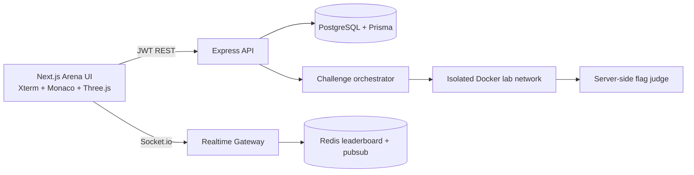

# HuntVerse Arena 2.0

## Pakistan's real-time multiplayer CTF battleground

HuntVerse Arena 2.0 is a full-stack architecture for authorized, isolated cybersecurity competitions. Two to fifty hunters join a room, solve containerized challenges, submit dynamic room flags, and compete on a live Socket.io scoreboard.

> This platform is for CTFs, owned labs, and explicit authorization only. Challenge containers must never expose a route to public targets or a host Docker socket.

## Architecture



## Monorepo

```text
huntverse-arena-2/
├── client/              # Next.js App Router arena UI
├── server/              # Express API, JWT, Prisma, room/challenge services
├── socket/              # Socket.io realtime gateway and Redis adapter
├── challenges-docker/   # Isolated challenge images and compose definitions
├── docker-compose.yml   # PostgreSQL, Redis, API, realtime services
└── README.md
```

## Product surfaces

- `/` landing terminal and arena join flow
- `/arena` live split view: challenge list, browser terminal, scoreboard, chat, kill feed
- `/labs` solo practice labs
- `/leaderboard` Pakistan global ranking
- `/profile/[username]` hunter rank, badges, first blood, and pwn history

## Challenge model

The starter catalog defines ten challenge families: SQLi, XSS, LFI, port scanning, hash cracking, OSINT, steganography, crypto, reverse shell, and privilege escalation. Every room receives a fresh flag seed. The server judges submissions against the room-scoped hash; flags are never trusted from the client.

## Local development

Prerequisites: Node.js 20+, Docker Desktop, and npm.

```bash
cp .env.example .env
npm install
npm run docker:up
npm run db:generate
npm run db:migrate
npm run dev
```

Client: `http://localhost:3000`  
API health: `http://localhost:4000/health`  
Socket gateway: `http://localhost:4001`

## Security boundaries

- Challenge containers run on an isolated Docker network with no host socket mounted.
- Use a dedicated VPS and disposable workers for production labs.
- Add rate limiting, 2FA, audit logs, room authorization, and container resource limits before public launch.
- Never point challenge tooling at third-party targets. The platform's evaluator is scoped to registered lab IDs.
- Replace every development secret and configure TLS, origin allowlists, and signed deploy artifacts.
